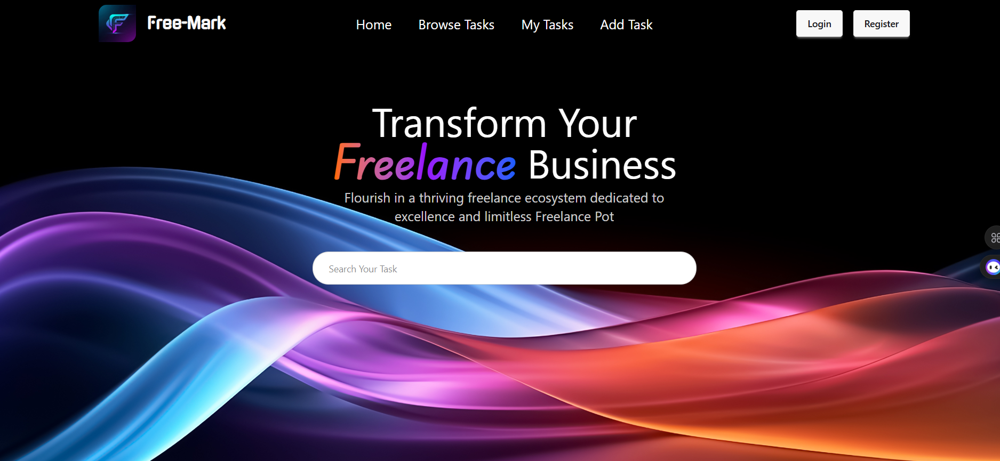

# 🚀 Free-Mark

## 🌐 Live Website

👉 https://free-mark.web.app/

---

## 📌 About the Project

**Free-Mark** is a freelance marketplace-inspired web application where employers can post job circulars and job seekers can explore and apply for opportunities. The platform focuses on simplicity, deadlines, and smooth interaction between employers and applicants.

---

## ✨ Features

* 📝 Employers can **post, edit, and delete job listings**
* 🔍 Users can **browse and search for available jobs**
* ⏰ Each job includes a **deadline to ensure timely applications**
* 📩 Job seekers can **apply directly through the platform**
* 📊 Clean and user-friendly interface for **better user experience**
* 🔐 Authentication system for secure access

---

## 🛠️ Technologies Used

* Frontend: HTML, CSS, JavaScript (React)
* Backend: Node.js, Express.js
* Database: MongoDB
* Backend Deployment: Vercel
*Frontend Deployment: Firebase

---

## 📷 Screenshots (Optional)

*Add screenshots of your project here*

---

## ⚙️ Installation & Setup

client side repository: https://github.com/ArnavHD/free-mark-client
server side repository: https://github.com/ArnavHD/free-mark-server

```bash
git clone https://github.com/ArnavHD/free-mark-client
cd free-mark-client
npm install
npm run dev
```

---

## 📬 Contact

If you have any feedback or suggestions, feel free to reach out!

---

⭐ Don’t forget to star the repo if you like the project!
